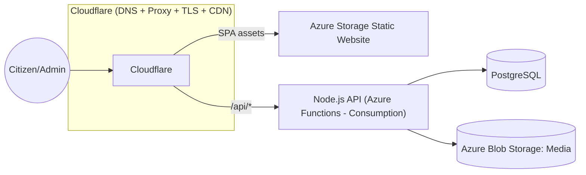
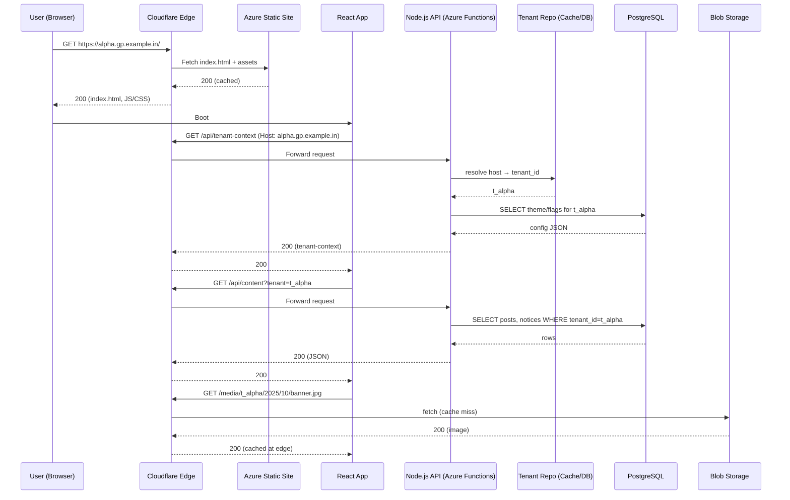
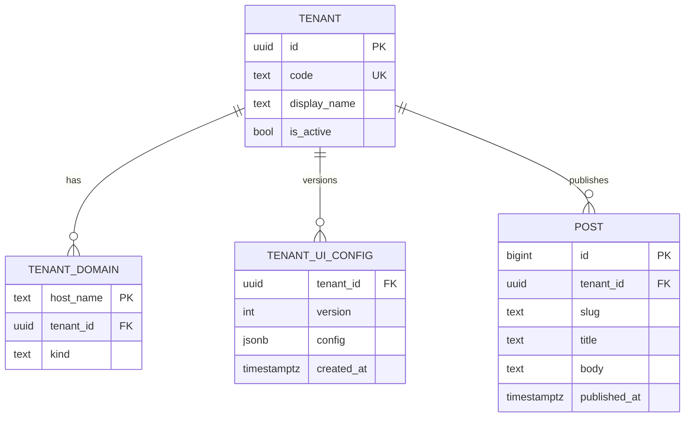
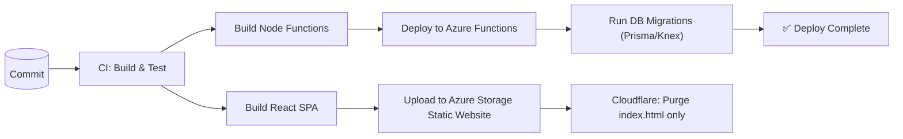
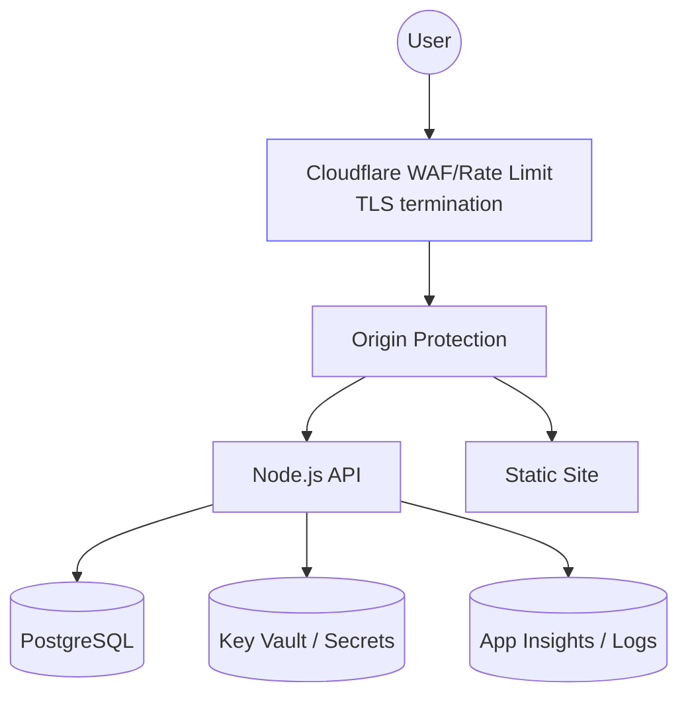

# Grampanchayat CMS — Mermaid Diagrams
**Date:** 2025-10-05

---

## 1) System Architecture (Budget Hybrid)

---

## 2) Request Lifecycle (Sequence)

---

## 3) Multi‑Tenant Data Model (ER)

---

## 4) CI/CD Pipeline

---

## 5) Security Layers

