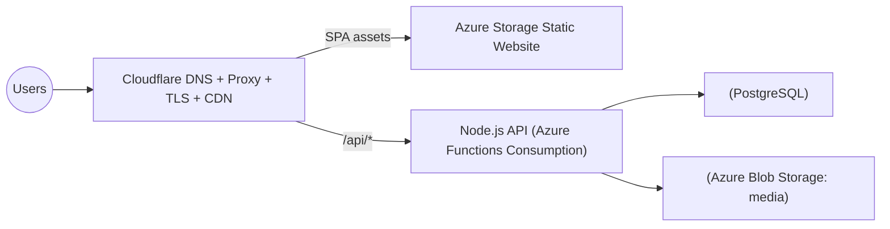

# Grampanchayat CMS — Hosting & Architecture Proposal
**Date:** 2025-10-05  
**Tech Stack:** React (SPA) • Node.js (Express/Nest) • PostgreSQL  
**Tenancy:** Multi-tenant (subdomain-per-gp), single backend

---

## 1) Context & Goals
- **Use-case:** Public CMS for multiple Gram Panchayats (GPs): notices, schemes, media gallery, contact details, RTI, forms, etc.
- **Traffic:** ~100 visits/day *total* (initially ~10 tenants, plan for up to 50). Admin usage ~1 login/day per tenant.
- **Constraints:** Keep **TCO very low** (≈ ₹1,000/year per subdomain target), while allowing growth.
- **Non-goals:** No per-tenant backend forks; one codebase and one shared backend.

---

## 2) Architecture Options (Summary)
### Option A — **Budget Hybrid (Recommended)**
> Meets the ₹1,000/subdomain/year target easily; simplest operations for now.

- **DNS + TLS + CDN:** Cloudflare (Free tier)
- **Static Hosting (React):** Azure Storage Static Website (very low cost) or Cloudflare Pages (Free)  
- **Backend API (Node.js):** Azure Functions **Consumption** *or* Cloudflare Workers / Pages Functions (for simple APIs)  
- **Database:** Azure Database for PostgreSQL Flexible (Burstable) *or* Railway/Neon Free/Starter tier (for dev/staging), production on Azure
- **Object Storage (media):** Azure Blob Storage (hot), served through Cloudflare CDN
- **Multi-tenancy:** Resolve **Host → tenant** at API; UI fetches `/api/tenant-context` at boot

**Pros:** Lowest cost, global CDN, free SSL, easy subdomains, scales to 50 tenants.  
**Cons:** Two vendors (Azure + Cloudflare), cold-start for Functions (usually acceptable at your scale).

---

### Option B — **Azure-only Minimal**
> Slightly higher cost; still lean but harder to hit ₹1,000/subdomain/year if you add Front Door.

- **DNS:** Azure DNS
- **Static Hosting:** Azure Storage Static Website
- **Backend:** Azure App Service (B1) *or* Azure Functions (Consumption)
- **CDN/TLS:** Azure Front Door (if you want many custom domains with managed TLS) — **cost driver**
- **DB:** Azure PostgreSQL Flexible

**Pros:** Single cloud, simple governance.  
**Cons:** Front Door + App Service base costs creep up vs Option A.

---

## 3) Recommended Design (Option A — Budget Hybrid)
A global, cache-first setup: **one React build** for all tenants; **one Node.js backend**; **one Postgres** cluster; **per-tenant UI at runtime**.



### 3.1 Tenancy Model
- Every request carries its **Host** (e.g., `alpha.gp.example.in`).  
- API resolves **host → tenant_id** (DB or Redis cache).  
- UI calls `GET /api/tenant-context` on boot to receive: theme, logo URLs, feature flags, locales, navigation schema, etc.  
- **No rebuilds per tenant.**

### 3.2 DNS & TLS
- Put the zone on **Cloudflare** (Free): unlimited subdomains, free SSL, proxy/caching.
- Create a proxied CNAME for each GP subdomain pointing to the **Azure static site** host.
- Proxy the API subdomain `api.example.in` to the **Function App** host.
- For future **custom tenant domains**: add a DNS entry in Cloudflare; SSL is auto-managed.

### 3.3 Security & Compliance
- **TLS everywhere** (Cloudflare → Azure origin).  
- **CORS allow-list** generated from `tenant_domain` table (no `*` with credentials).  
- **Auth** (if needed): per-tenant issuer (OIDC) with redirect URLs per host.  
- **Headers:** HSTS, CSP (tight img/media/CDN list), Referrer-Policy, X-Frame-Options.  
- **Rate limiting**: Cloudflare rules per-tenant host; backend also enforces caps per API key/tenant.  
- **Data isolation:** Row-level tenancy via `tenant_id` on each table; guard in API layer.

### 3.4 Components
- **React SPA:**  
  - Loads `/api/tenant-context` before rendering.  
  - Applies theme via CSS variables; toggles features/routes via flags.  
  - Avoid hardcoding secrets; media served from `/media/{tenant}/{path}` (signed URLs optional).

- **Node.js API (Express/Nest in Azure Functions):**  
  - **Middleware** reads `Host` and resolves tenant.  
  - `GET /api/tenant-context` returns safe config (no secrets).  
  - `GET /api/content` returns CMS data filtered by `tenant_id`.  
  - Media uploads → Blob Storage `{tenant}/yyyy/mm/slug.ext`  
  - ETag/Last-Modified for caching list endpoints.

- **PostgreSQL (multi-tenant):**
  - Tables have `tenant_id`.  
  - Add partial indexes per active tenant if needed.  
  - Nightly logical backups to Blob Storage (pg_dump) + point-in-time if using managed Azure PG.

- **Blob Storage:**
  - Public reads via Cloudflare cache; uploads via signed PUT URL (scoped to tenant folder).

### 3.5 DevOps & CI/CD
- **Monorepo** with `apps/web` (React), `apps/api` (Node/Functions), `infra/` (IaC).  
- **CI:** GitHub Actions/Azure DevOps:
  1. Build React → upload to Azure Storage (cache-busted filenames).  
  2. Deploy Functions API.  
  3. Run DB migrations (Prisma/Knex/TypeORM).  
  4. Purge Cloudflare cache for `index.html` only (assets are immutable).

---

## 4) Cost Outlook (Initial 10 tenants)
> Target: keep total platform spend ≈ ₹100–₹300/month (₹1,200–₹3,600/year total ≈ ₹120–₹360 per subdomain/year at current scale).

| Component | Plan | Qty | Est. Monthly (INR) | Notes |
|---|---|---:|---:|---|
| Cloudflare | Free | 1 | **0** | DNS+TLS+CDN, unlimited subdomains |
| Azure Storage (Static Web) | Hot | 1 | **≤ 100** | Light traffic; includes ops & a few GB storage |
| Azure Functions | Consumption | 1 | **0–200** | Pay-per-exec; low traffic ⇒ negligible |
| Azure PostgreSQL | Flexible B1ms | 1 | **900–1,200** | Can downsize/stop in dev; production minimal |
| Azure Blob (media) | Hot | 1 | **≤ 100** | Gallery/images; CDN in front |
| **Total (10 tenants)** |  |  | **~₹1,000–₹1,600 / month** | ≈ ₹100–₹160 per subdomain/month now; drops per subdomain as tenants grow |

> With 50 tenants at similar traffic, cost per subdomain typically **decreases**, since most charges are shared.

---

## 5) Data Model (Sketch)
```sql
CREATE TABLE tenant (
  id UUID PRIMARY KEY,
  code TEXT UNIQUE NOT NULL, -- e.g., 'alpha'
  display_name TEXT NOT NULL,
  is_active BOOLEAN NOT NULL DEFAULT TRUE
);

CREATE TABLE tenant_domain (
  host_name CITEXT PRIMARY KEY,   -- 'alpha.gp.example.in'
  tenant_id UUID REFERENCES tenant(id) ON DELETE CASCADE,
  kind TEXT CHECK (kind IN ('spa','admin','api','marketing')) DEFAULT 'spa'
);

CREATE TABLE tenant_ui_config (
  tenant_id UUID REFERENCES tenant(id) ON DELETE CASCADE,
  version INTEGER NOT NULL,
  config JSONB NOT NULL,
  created_at TIMESTAMPTZ NOT NULL DEFAULT now(),
  PRIMARY KEY (tenant_id, version)
);

-- Example CMS tables
CREATE TABLE post (
  id BIGSERIAL PRIMARY KEY,
  tenant_id UUID NOT NULL REFERENCES tenant(id),
  slug TEXT NOT NULL,
  title TEXT NOT NULL,
  body TEXT NOT NULL,
  published_at TIMESTAMPTZ,
  UNIQUE(tenant_id, slug)
);
```

---

## 6) API Surface (Example)
```
GET  /api/tenant-context
GET  /api/pages/:slug
GET  /api/notices?limit=20
GET  /api/media?path=/
POST /api/media/upload     (signed URL)
POST /api/admin/login
POST /api/admin/pages
PUT  /api/admin/pages/:id
```

### Middleware (Node/Express)
```js
app.use(async (req, res, next) => { 
  const host = (req.headers['x-forwarded-host'] || req.headers.host || '').toLowerCase();
  const tenant = await tenantRepo.getByHost(host);
  if (!tenant) return res.status(404).json({ error: 'Unknown tenant' });
  req.tenant = tenant;
  next();
});
```

---

## 7) Security & Hardening Checklist
- [ ] Cloudflare proxy on for all public hosts; disable direct origin access (lock down Storage/Functions by IP allow-list if possible).  
- [ ] CORS dynamic allow-list from `tenant_domain`.  
- [ ] JWT-based admin auth; per-tenant RBAC for editors.  
- [ ] CSP with strict `img-src`, `media-src`, `connect-src`.  
- [ ] Rate limit API (Cloudflare + backend).  
- [ ] Encrypt at rest (Blob/PG), rotate keys in Key Vault.  
- [ ] Backups: nightly `pg_dump` + weekly restore test.  
- [ ] Infra as Code (Bicep/Terraform) committed and reviewed.

---

## 8) Rollout Plan
1. **Week 1:** Provision core infra; seed DB with 2–3 pilot tenants; DNS on Cloudflare.  
2. **Week 2:** Implement tenant-context endpoint; UI theming + feature flags; media uploads.  
3. **Week 3:** Migrations for CMS data; admin portal; content import.  
4. **Week 4:** Pilot launch (2–3 GPs), observe metrics, fix, and template the onboarding flow.

**Onboarding a new GP (30–60 min):**
- Create tenant row + add subdomain in Cloudflare; wait SSL green.  
- Upload logo/theme & initial content; verify `/api/tenant-context`.  
- Share admin credentials; publish.

---

## 9) Future Enhancements
- Caching layer (Redis) for hot endpoints.  
- Search (Meilisearch/Typesense) per tenant.  
- Form builder + submissions with reCAPTCHA.  
- Scheduled publishing, versioning & audit logs.  
- WhatsApp/SMS notifications per tenant via queue.

---

## 10) Decision
Proceed with **Option A (Budget Hybrid)** to meet cost target and time-to-market. Keep codebase portable so we can switch to fully-Azure stack later if traffic, compliance, or governance requires.
